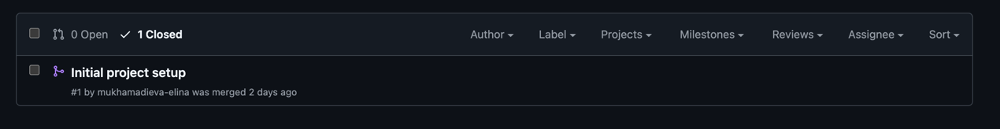
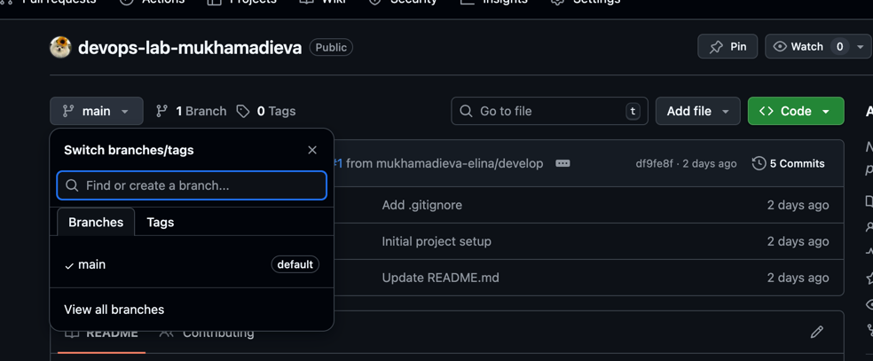

University: [ITMO University](https://itmo.ru/ru/)\
Faculty: [FICT](https://fict.itmo.ru)\
Course: [Введение в веб технологии](https://itmo-ict-faculty.github.io/introduction-in-web-tech/)\
Year: 2025/2026\
Group: U4125\
Author: Mukhamadieva Elina Varisovna\
Lab: Lab0\
Date of create: 01.03.2026 \
Date of finished 01.03.2026 \

Ход работы:
1) Аккаунт на GitHub уже существовал, был сгенерирован новый SSH ключ для работы с репозиториями
2) Создала новый репозиторий: https://github.com/mukhamadieva-elina/devops-lab-mukhamadieva
3) С репозиторием работала через среду разработки Pycharm, склонировала репозиторий с помощью команды git clone
4) Создала README.md, .gitignore файлы с описанием проекта
5) Далее создала новую ветку develop, в ней добавила новый файл CONTRIBUTING.md
6) Сделала коммит в данной ветке, чтобы потом слить изменения в main ветку
7) Смержила pull request и удалила ветку develop

