University: [ITMO University](https://itmo.ru/ru/)\
Faculty: [FICT](https://fict.itmo.ru)\
Course: [Введение в веб технологии](https://itmo-ict-faculty.github.io/introduction-in-web-tech/)\
Year: 2025/2026\
Group: U4125\
Author: Mukhamadieva Elina Varisovna\
Lab: Lab1\
Date of create: 02.03.2026\
Date of finished:

Ход работы:
1) Docker Desktop уже установлен 
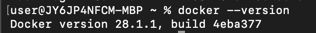
2) Локальные образы:
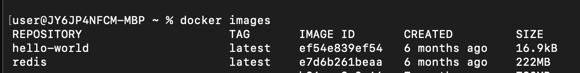
3) Список запущенных контейнеров:
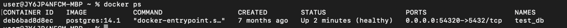
4) Список всех контейнеров:
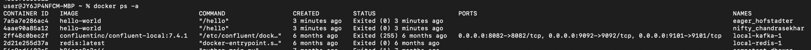
5) Скачала образ Ubuntu:
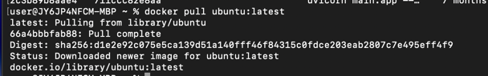
6) Запустила интерактивно контейнер и установила пакет curl:
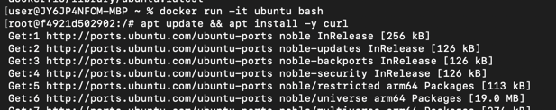
7) Проверила установку curl и вышла из контейнера:
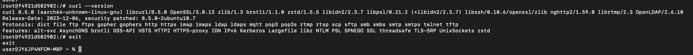
8) Запустила контейнер с nginx (так как образа не было, он скачался)
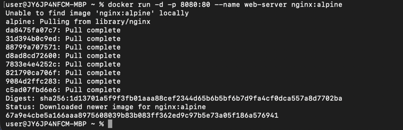
9) Проверила работу на локальном хосте, все корректно:
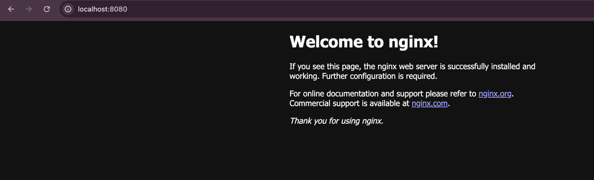
10) По логам видно успешное выполнение get запроса:
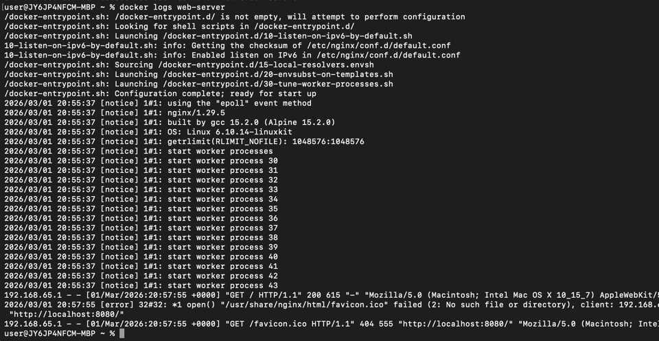
11) Подключилась к контейнеру и выполнила команду ls:
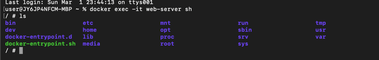
12) Список запущенных контейнеров (добавился nginx):
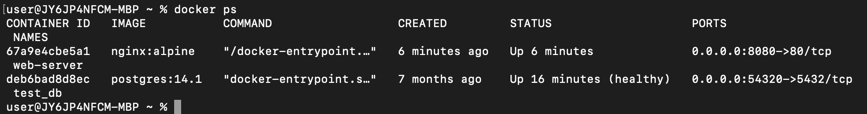
13) Список всех контейнеров:
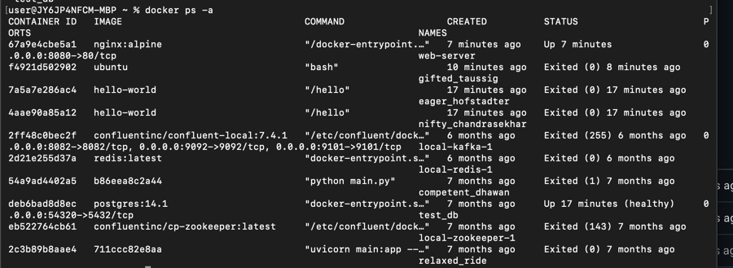
14) Остановила, запустила и снова остановила контейнер web-server, удалила контейнер и образ:
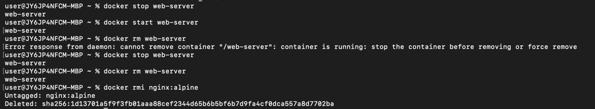
15) Создала том, запустила контейнер с томом, подключилась к контейнеру, создала файл в томе:
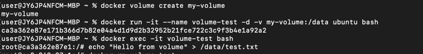
16) Удалила контейнер и создала новый с тем же томом
17) В контейнере запустила команду ls, далее cat для проверки содержимого файла:
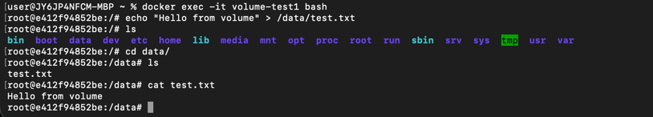