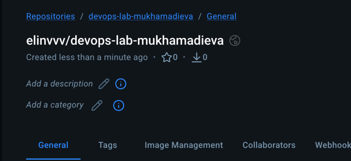
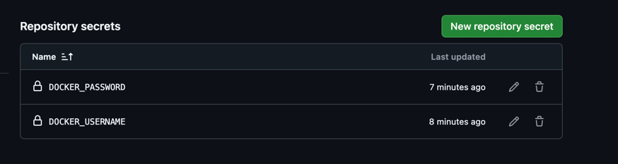
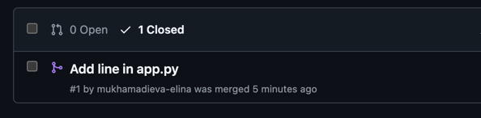
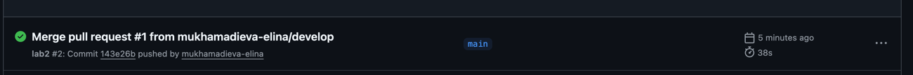
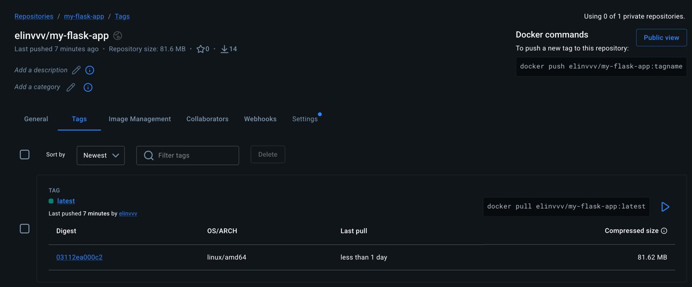
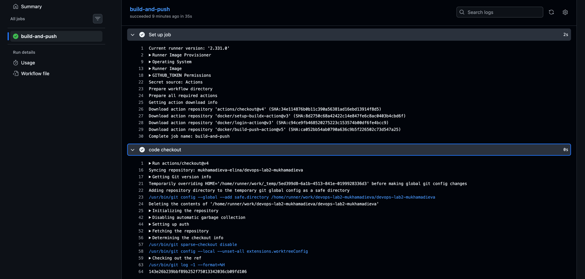
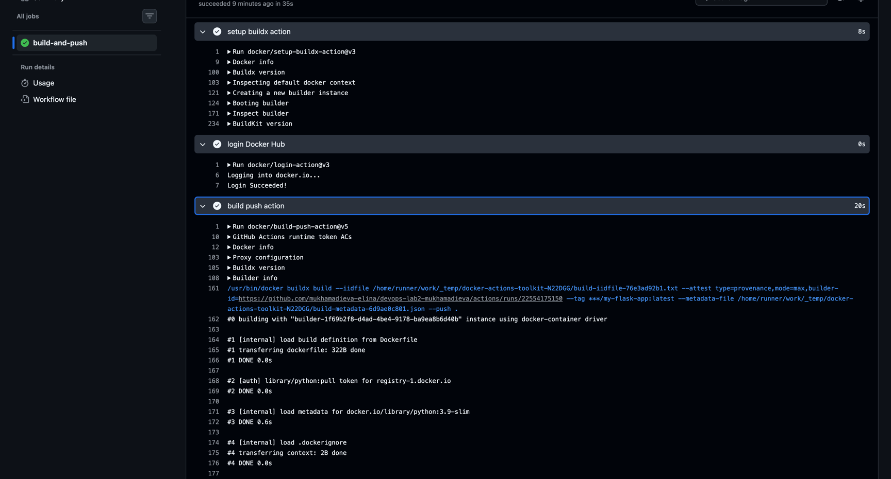
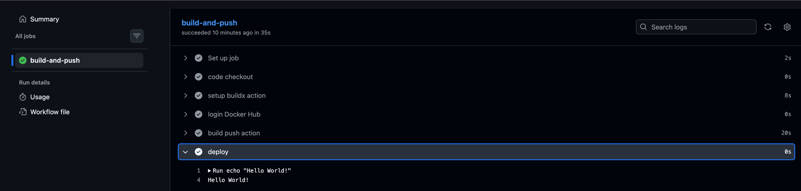

University: [ITMO University](https://itmo.ru/ru/)\
Faculty: [FICT](https://fict.itmo.ru)\
Course: [Введение в веб технологии](https://itmo-ict-faculty.github.io/introduction-in-web-tech/)\
Year: 2025/2026\
Group: U4125\
Author: Mukhamadieva Elina Varisovna\
Lab: Lab2\
Date of create: 02.03.2026\
Date of finished:

Ход работы:
1) Создала аккаунт на Docker Hub и репозиторий: \

2) Создала папку .github/workflows/ и файл docker-build.yml с пайплайном по заданию в новом репозитории https://github.com/mukhamadieva-elina/devops-lab2-mukhamadieva 
3) В настройках репозитория добавила секреты, которые используются в docker-build.yml:

4) Сделала коммит и пуш в ветку main:

5) Выполнение пайплайна в Actions:

6) Образ на Docker Hub:

7) Логи:

