University: [ITMO University](https://itmo.ru/ru/)\
Faculty: [FICT](https://fict.itmo.ru)\
Course: [Введение в веб технологии](https://itmo-ict-faculty.github.io/introduction-in-web-tech/)\
Year: 2025/2026\
Group: U4125\
Author: Mukhamadieva Elina Varisovna\
Lab: Lab3\
Date of create: 02.03.2026\
Date of finished:

Ход работы:
1) Создала файл prometheus/prometheus.yml с информацией о частоте сбора метрик, метриками prometheus и метриками системы
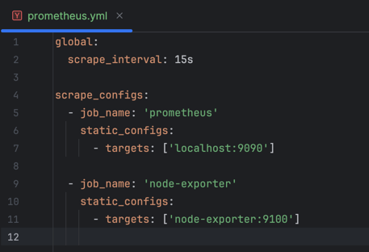
2) Запустила контейнер Node Exporter и проверила его работу:
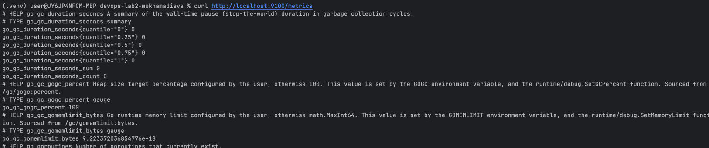
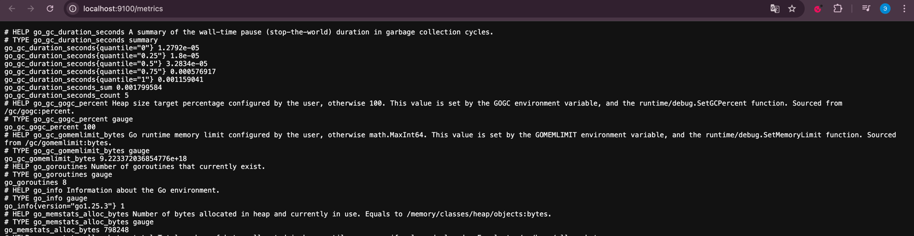
3) Создала том prometheus-data, для работы с grafana создала общую сеть monitoring
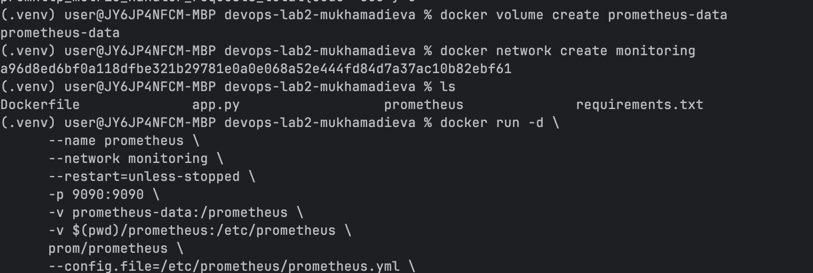
4) Работа prometheus на локальном хосте:
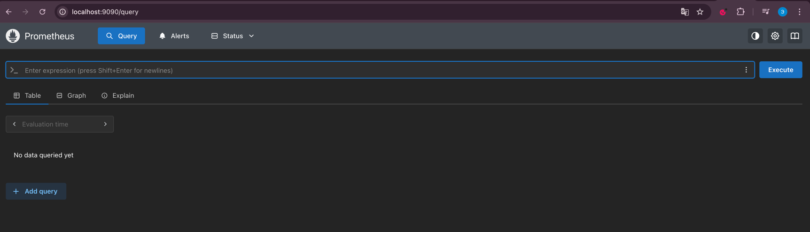
5) Создала том grafana-data и запустила контейнер:
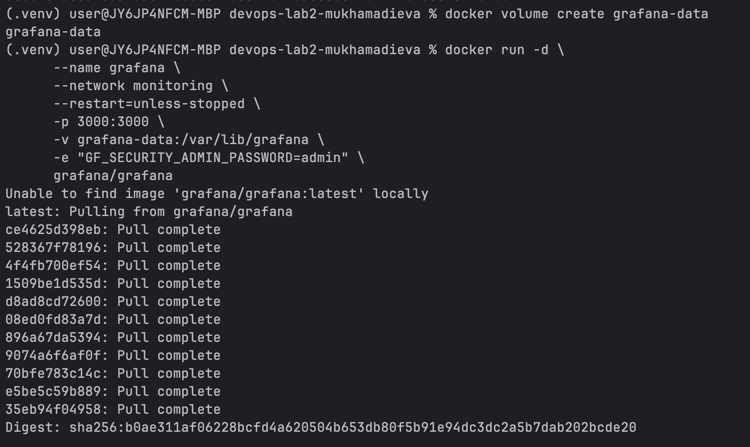
6) На локальном хосте графана работает:
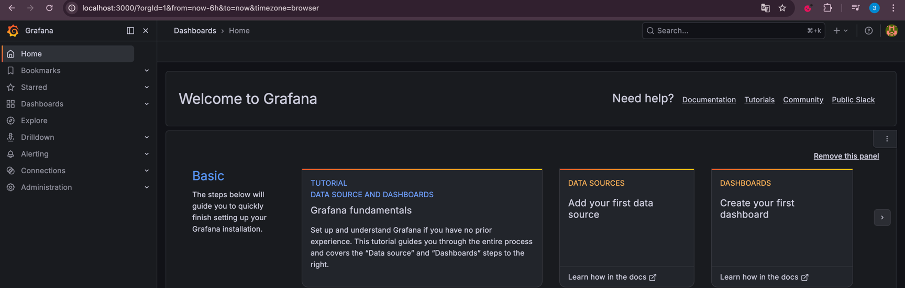
7) Залогинилась под админом в графане, далее добавила источник данных prometheus:
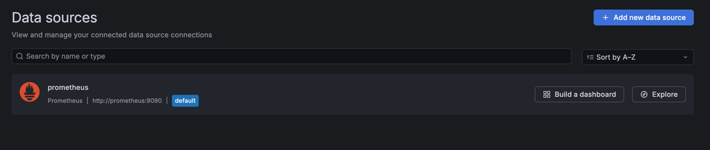
8) В prometheus проверила доступность node-exporter:
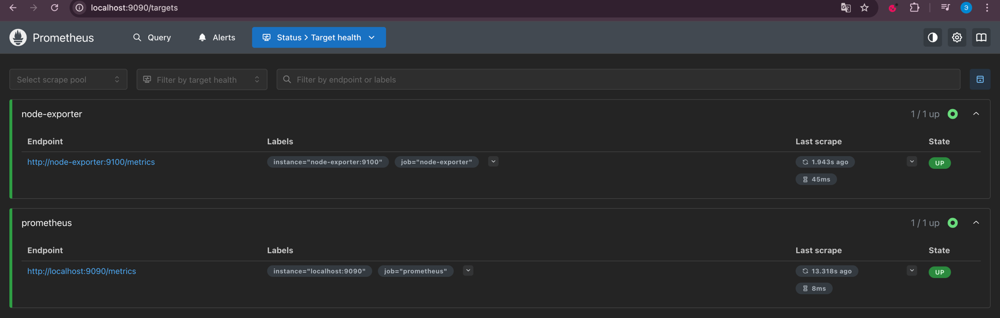
9) Добавила метрики node_cpu_seconds_total, node_memory_Active_bytes, node_memory_MemAvailable_bytes, node_disk_io_now
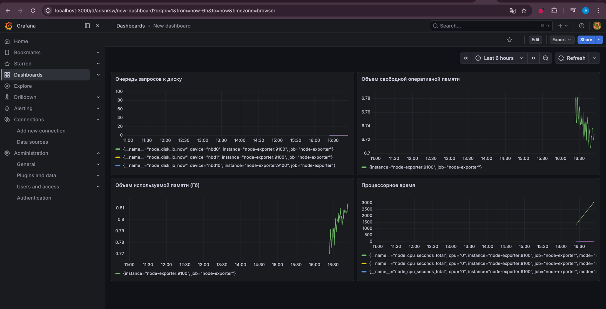
10) Проверка контейнеров:
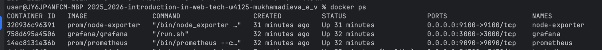
11) Метрики собираются, данные визуализируются